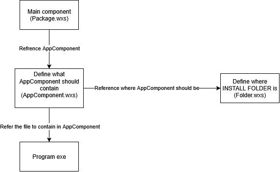

# GOAL 1: We want an installer that install, that's it.

To achieve this, we will need to first build the project to get the `Sir Answers-a-Lot.exe`.

## Preparing the executable

### Dependencies to build the project

- .NET 9+

### Process

- `cd` to the directory called `Sir Answers-a-Lot`
- Then call

  ```bash
  dotnet publish -c Release -r YOUR_OS
  ```

- `YOUR_OS` should be one of these

  - `win-x64`
  - `linux-x64`
  - `osx-x64`.

- When complete you should be able to see an executable called `Sir Answers-a-Lot.exe` in `bin/Release/net9.0/YOUR_OS/publish` with all other .dll.

## Let's actually start on building installer.

### Prequisuite

- .NET SDK

### Steps

1. Create a new folder called `Installer` (You can change `Installer` with anything you like)
2. Create a new file in the project called `Installer.wixproj` with the following content
   ```xml
   <Project Sdk="WixToolset.Sdk/6.0.0">
   </Project>
   ```
3. Create a new WiX source file named `Package.wxs` with the following content.

   ```xml
   <Wix xmlns="http://wixtoolset.org/schemas/v4/wxs">
      <Package
          Name="WiXInstaller"
          Manufacturer="TODO Manufacturer"
          Version="1.0.0.0"
          UpgradeCode="3c1d7649-fabe-4734-923a-9c8fb6d06fe9" // This is an example GUID
          >
        <Feature Id="Main">
          <ComponentGroupRef Id="AppComponents" />
        </Feature>
      </Package>
    </Wix>
   ```

4. Create a new WiX source file named `AppComponents.wxs` with the following content.

   ```xml
   <Wix xmlns="http://wixtoolset.org/schemas/v4/wxs">
    <Fragment>
      <ComponentGroup Id="AppComponents" Directory="INSTALLFOLDER">
          <File Source="..\..\SirAnswers-a-Lot\bin\Release\net9.0\win-x64\publish\SirAnswers-a-Lot.exe" />
      </ComponentGroup>
    </Fragment>
   </Wix>
   ```

5. Create a new WiX source file called `Folder.wxs` with the following content.
   ```xml
   <Wix xmlns="http://wixtoolset.org/schemas/v4/wxs">
     <Fragment>
       <StandardDirectory Id="ProgramFiles6432Folder">
         <Directory Id="INSTALLFOLDER" Name="!(bind.Property.Manufacturer) !(bind.Property.ProductName)" />
       </StandardDirectory>
     </Fragment>
   </Wix>
   ```
6. Type `dotnet build` in the installer folder.
7. Your installer will not located in `bin\Debug` inside the `WiXInstaller` folder called `WiXInstaller.msi`.
   - You can try run it to see how it looks like.
   - The exectuable is located in `Program Files (x86)\TODO Manufacturer WiXInstaller`.
   - To uninstall, you can do that through the normal method in `Installed apps` section the program will be called `WiXInstaller`.

#### Diagram summary



#### Explanations

This section is for explain what each component do and what does each attribute mean in each component simplified.

If you are interested in all detail about each component then I suggested go on the [official documentation](https://docs.firegiant.com/).

##### Package component

```xml
<Package
  Name="WiXInstaller"
  Manufacturer="ManufacturerName"
  Version="1.0.0.0"
  UpgradeCode="GenerateGUID">
```

Where:

- `Name`: An attribute that will set your installed software name. (It will be show in the `Installed app` list)
- `Manufacturer`: An attribute that will claim who made the software. (It willl also be show in the `Installed app` list)
- `Version`: Attribute to set version of the installer. This will also be use to determine whether installer will run as upgrade or downgrade mode.
- `UpgradeCode`: An attribute used for idetifying your installer. This will play in a big role for your installer to know whether it was already installed on the machine or not.

##### Feature component

```xml
  <Feature Id="Main">
```

- MSI will require at least one feature. Now that you add it you can add anything in the installer inside this component to make it relevant.
- Just like react WiX and XML general, nested elements translate to a relationship parent and child elements.

##### References

```xml
<ComponentGroupRef Id="ExampleComponents" />
```

- Just like most things, referencing is important to help you manage your source code better by not just having one single file for the whole project.
- However, to get the content of those located outside of the file referencing is needed.
- For example, this line here is referencing to a `ComponentGroup` component that has `Id="ExampleComponents"`.

##### Fragment component

```xml
<Fragment />
```

- A Fragment component is a container for installer definitions (Example: directories and components).
- Used to split the installer into smaller, reusable, and maintainable parts.
- Fragments are referenced from the main product definition and merged at build time.

##### ComponentGroup component

```xml
<ComponentGroup Id="ComponentsId" Directory="PATH">
```

- Use for grouping components together.
- `Id`: Identifier for the `ComponentGroup`. Can be reference using `<ComponentGroupRef>` (Required)
- `Directory`: Sets the default directory identifier

##### File component

```xml
<File Source="PATH">
```

- This component is used to reference a file that you want the installer to contain.
- This file will be installed to the directory that was reference by the parent component.
- You can also add `Directory` attributes to this component if this component does not have a parent and you are working on WiX 5 or above. If you don't provide it, but it doesn't have a parent component it will default to use `INSTALLFOLDER` for `Directory`.

##### StandardDirectory component

```xml
<StandardDirectory Id="StandardDirectoryType">
```

- `Id` The identifier of the standard directory to include in the package.
- Here's a [link](https://docs.firegiant.com/wix/schema/wxs/standarddirectorytype/) to what was supported for standard directory.

##### Directory component

```xml
<Directory Id="Id" Name="Name" />
```

- `Id` is optional attribute. But in our use case we want it to be use when `INSTALLFOLDER` was referenced.
- `Name` the name of directory you are expected to mapped to. Both for creation or target as source.
