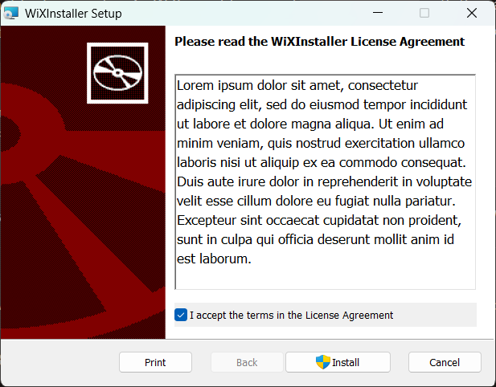
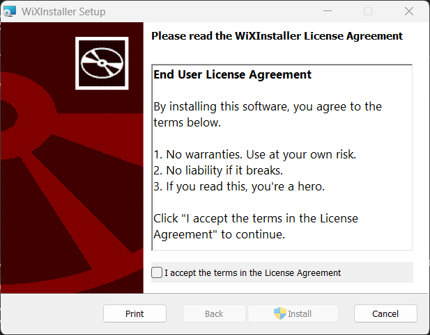

# GOAL 2: We want to add a user term agreement

## Issues

How do we allow user to interact with the installer?

## Solution

To interact with user we will need UI!

But...how?

Good news, WiX already have a preset for it so we don't need to build from scracth.

## Adding UI for user term agreement

- Warning: If you have installer already open, you will not able to build the installer again.
- Make sure you closed the current installer, before rebuild.

### Steps

1. Reference to the WiX UI extension package. By addiding the following lines to the `WiXInstaller.wixproj`
   ```xml
   <ItemGroup>
       <PackageReference Include='WixToolset.UI.wixext' Version='6.0.0-rc.1'/>
   </ItemGroup>
   ```
2. Add `xmlns:ui="http://wixtoolset.org/schemas/v4/wxs/ui` attribute to Wix component in `Package.wxs`.
3. Then add `ui:WiXUI` component to the Package component.
   ```xml
   <ui:WixUI Id="WixUI_Minimal" />
   ```
4. If you try to build and run the installer you should now see a UI, yay!.

   

## Customize text on the license agreement

- It's nice that we now have UI, however, lorem ipsum can't be use to to set up an agreement.
- That's why we need to customize the text.

### Steps

1. Create the RTF file that contains your user term agreement. (The file extension should be .rtf)

   - The file could be created in `Microsoft Word`.
   - If it's not displaying, try to select the text in the box to display.
   - But to prevent that from happening, try to use simple fonts and very small font size (Less than 12)

   ```rtf
    {\rtf1\ansi\deff0
    {\fonttbl{\f0\fnil\fcharset0 Segoe UI;}}
    \pard\f0\fs24\b End User License Agreement\b0\par
    \par
    By installing this software, you agree to the terms below.\par
    \par
    1. No warranties. Use at your own risk.\par
    2. No liability if it breaks.\par
    3. If you read this, you're a hero.\par
    \par
    Click "I Agree" to continue.\par
    }
   ```

2. Then reference it somewhere in the project. I would recommend put it in the `Package.wxs`. (Should be inside `Fragment` or `Package` component)
   ```xml
   <WixVariable Id="WixUILicenseRtf" Value="lawStuff.rtf" />
   ```
3. Make sure that you close any process that accessing the rtf file.
4. Build and run it again. Done!

   
