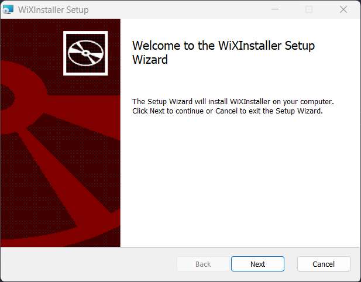
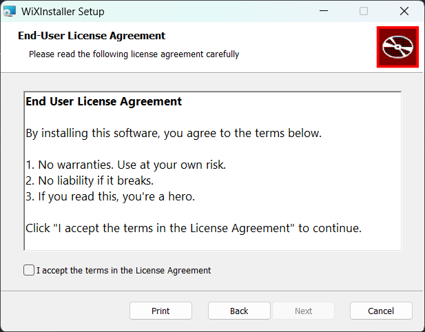
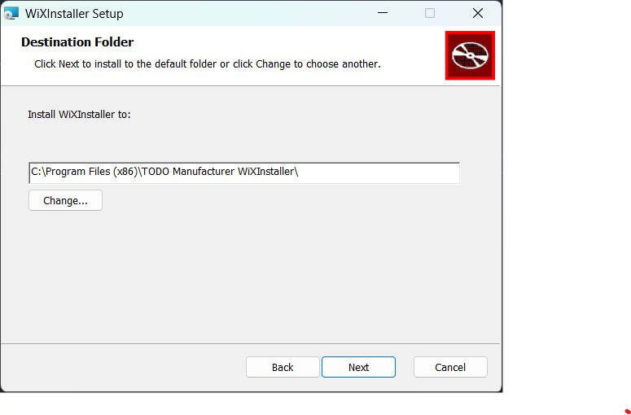
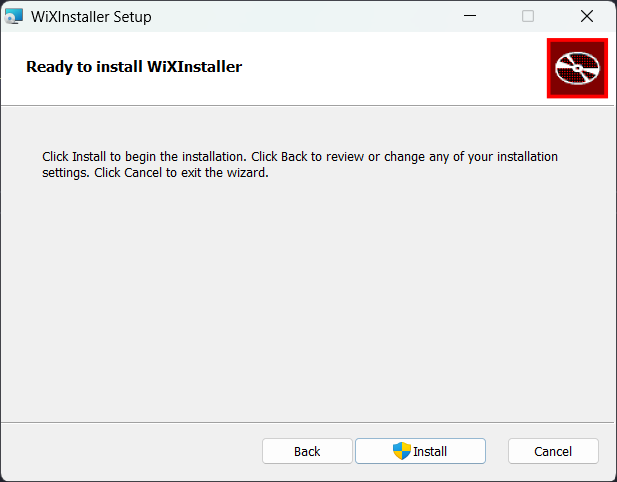

# GOAL 3: We want user to be able to customize where to install the program.

Now that we got UI working and legal out of the way.

The next thing we want is to allow user to select where they want the program to be installed.

## Issue

- Is this is when we will actually customize the UI to add a feature? The answer to that is **no**!
- Similar to user agreemnent page, most product have these two pages as default.
- Becuase of that, WiX already have a template for us to use.

### Steps

1. Edit the `ui:WiXUI` component you added previously in `Package.wxs` as follow.

   ```xml
   <ui:WixUI Id="WixUI_InstallDir" InstallDirectory="INSTALLFOLDER" />
   ```

2. Rebuild, run and done!

   - Welcome dialog

     

   - User agreement dialog

     

   - Install location selection dialog

     

   - Confirmation dialog

     
