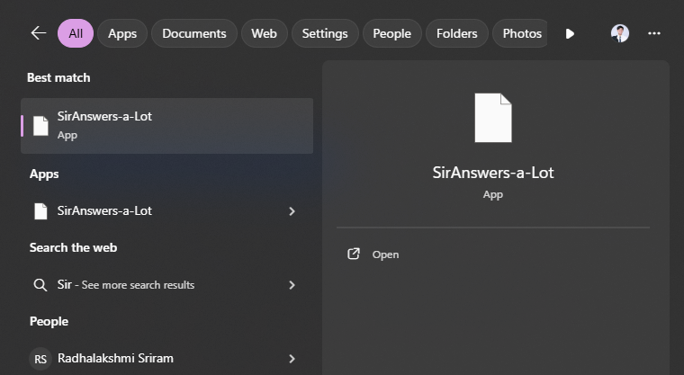
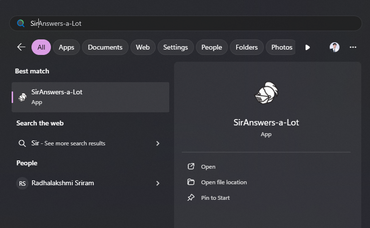

# GOAL 4: We want to create shortcuts for user.

Currently, our installer have most normal feature covered.

However, there is one big paint point we haven't address yet.

That is the application is located in `Program Files (x86)` which is not convienient for user to access at all.

That's why our goal this time is to create a shortcut which will resolve this pain point.

## Issue

- How do we create shortcut using WiX?
- Creating shortcut when installing is not something new.
- That's why WiX already have a component to handle this.

### Steps

1. The componenet that we will be using is `Shortcut` component. The possible parent components are `File`, `CreateFolder` and `Component`. We want the shortcut to target at the executable. Thus, we will add it inside the `File` component in `AppComponents.wxs`.

2. Before we add `Shortcut` component let's start from turning the current `File` component to become non-self-closing tag component.

   ```xml
     <File Source="..\..\SirAnswers-a-Lot\bin\Release\net9.0\win-x64\publish\SirAnswers-a-Lot.exe">
     </File>
   ```

3. Let's add shortcut to the `Desktop`.
   ```xml
   <File ...>
     <Shortcut
       Id="DesktopShortcut"
       Directory="DesktopFolder"
       Name="SirAnswers-a-Lot"
       Advertise="yes"
     />
   </File>
   ```
4. Let's add shortcut to the `ProgramMenuFolder` so that its discoverable via Window Search.

   ```xml
   <File ...>
     <Shortcut
       Id="StartMenuShortcut"
   	   Directory="ProgramMenuFolder"
       Name="SirAnswers-a-Lot"
       Advertise="yes"
     />
     <Shortcut
       ...
     />
   </File>
   ```

5. After rebuild the solution and install you will now see your application in your desktop folder and it could also be found through Windows search. Yay!
   

6. It works, but it doesn't look nice. Let's add an icon to make the shortcut stand out. That is done by first adding the icon you want to the project.

7. Then you add `Icon` component to the `Package.wxs`. This is to import the icon to the installer`

   ```xml
     <Package
       ...
     >
       <Icon Id="AppIcon.ico" SourceFile="knight-helmet.ico" />
       <WixVariable ... />
       <ui:WixUI ... />
       <Feature Id="Main">
         ...
       </Feature>
     </Package>
   </Wix>
   ```

8. However, this is just adding the concept of icon, but the installer still does not know where to use this icon. This where you add the icon reference to the shortcuts.
   ```xml
   <File Source="..\..\SirAnswers-a-Lot\bin\Release\net9.0\win-x64\publish\SirAnswers-a-Lot.exe">
     <Shortcut
       ...
       Icon="AppIcon.ico"
     />
     <Shortcut
       ...
       Icon="AppIcon.ico"
     />
   </File>
   ```
9. Rebuild and done now you have a good looking shortcut.
   

#### Explanations

Since the `Icon` component is quite straight forward, I will only explain something in more detail for `Shortcut` component as it has many attributes.

##### Shortcut component

```xml
  <Shortcut
    Id="DesktopShortcut"
    Directory="DesktopFolder"
    Name="SirAnswers-a-Lot"
    Advertise="yes"
    Icon="AppIcon.ico"
  />
```

- `Id`: Uniquely identify a component
- `Directory`: Where the shortcut be located. (Ex. `DesktopFolder` and `ProgramMenuFolder`)
- `Name`: Name that will be display.
- `Advertise`:
  - `yes`: self-healing shortcut via MSI. In this case we are the parent component is a single file, thus, it is required for us to set to `yes`
  - `no`: plain direct link (default)
- `Icon`: Icon that will be displayed.
